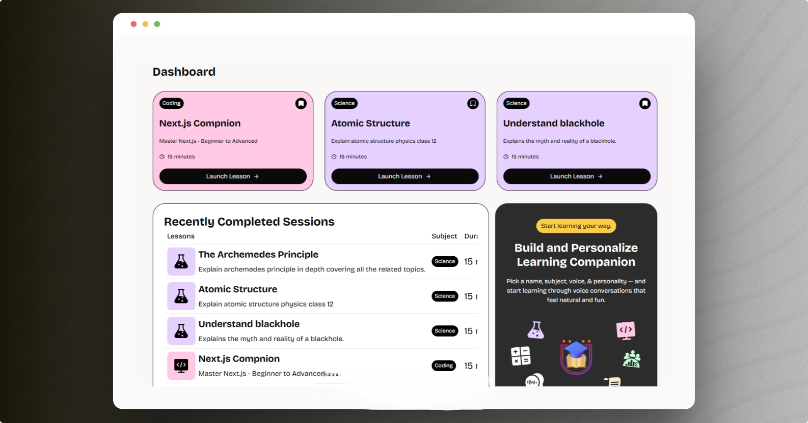

# LearnVox - AI Teaching & Learning Platform



LearnVox is a modern, real-time AI-powered teaching and learning platform designed for corporate training and educational institutions. It leverages AI companions to deliver personalized, interactive lessons with voice capabilities.

## 🌟 Features

- **AI-Powered Companions** — Create and manage intelligent AI teaching assistants with customizable personalities, teaching styles, and subject expertise
- **Real-Time Voice Interaction** — Engage with AI companions through voice input and receive immediate, conversational responses
- **Rich Lesson Library** — Browse and filter lessons by subject, topic, and difficulty
- **Bookmark Management** — Save favorite lessons for quick access later
- **Session History** — Track your learning progress with complete session records
- **Responsive Design** — Seamless experience across desktop, tablet, and mobile devices
- **User Authentication** — Secure sign-in with Clerk authentication
- **Subscription Plans** — Flexible pricing with companion creation limits

## 🚀 Getting Started

### Prerequisites

- Node.js 18+
- npm or yarn
- Supabase account
- Clerk account for authentication

### Installation

1. **Clone the repository:**

```bash
git clone https://github.com/keshav7662/LearnVox.git
cd LearnVox
```
2. **Install dependencies:**
```bash
npm install
```
3. **Set up environment variables:**
Create a .env.local file in the root directory and add:
```bash
# Clerk Authentication
NEXT_PUBLIC_CLERK_PUBLISHABLE_KEY=your_clerk_publishable_key
CLERK_SECRET_KEY=your_clerk_secret_key

# Clerk - Custom Auth
NEXT_PUBLIC_CLERK_SIGN_IN_URL=/sign-in
NEXT_PUBLIC_CLERK_SIGN_IN_FALLBACK_REDIRECT_URL=/
NEXT_PUBLIC_CLERK_SIGN_UP_FALLBACK_REDIRECT_URL=/

# Supabase
NEXT_PUBLIC_SUPABASE_URL=your_supabase_url
NEXT_PUBLIC_SUPABASE_ANON_KEY=your_supabase_anon_key

# Vapi (Voice API)
NEXT_PUBLIC_VAPI_TOKEN=your_vapi_token
```
4. **Run the development server:**
```bash
npm run dev
```
5. **Open in browser:**
```bash
Navigate to http://localhost:3000
```
6. **Build for production:**

```bash
npm run build
npm start
```
7. **Project Structure:**
```bash
├── app/               # Next.js App Router
├── components/        # Reusable UI + features
├── hooks/             # Custom hooks
├── lib/               # Supabase, Clerk, Vapi utilities
├── styles/            # Global styling
├── public/            # Static assets (logo, banner, etc.)
└── README.md
```
## 🛠️ Tech Stack

#### **Frontend**: Next.js 14 (App Router), React 18, TypeScript  
#### **Styling**: Tailwind CSS, PostCSS  
#### **UI Components**: shadcn/ui, Radix UI  
#### **Backend**: Next.js Server Actions  
#### **Database**: Supabase (PostgreSQL)  
#### **Authentication**: Clerk  
#### **Voice**: Vapi SDK  
#### **Forms & Validation**: React Hook Form, Zod  
#### **Deployment**: Vercel


